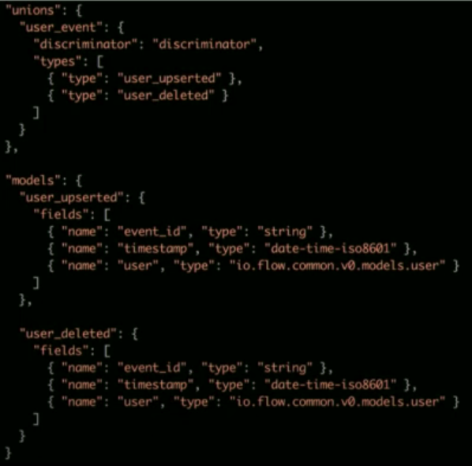

https://www.youtube.com/watch?v=j6ow-UemzBc&ab_channel=InfoQ

# API Architecture
- design api: first. the design must be language neutral, not in code (swagger, ....)
    - not good
        - https://fastapi.tiangolo.com/advanced/generate-clients/
        - https://github.com/digitalliving/openapi-to-fastapi
- design api: 2 models. One for the resource. One for the resource spec (form)
    - we good
- api: ci/cd.... OF COURSE
- api builder ? https://www.apibuilder.io/
- api code generation from design first:
    - consistency => feel like "the api has been built by one person"
    - no dev value to wrote api route again & again...
    - mock and client from the same source
        - high fidelity fast testing for everyone (builder & client)

# Database Architecture
- each ms application owns its database
- not other service is allowed to connect to the database, it is private
- other services use only the service interface (API+events) 
- db and table generation are standard though code generation
    - enforce global rule (e.g: forbid empty string)
    - hash_code optimization (only update entry where the hash_code has been updated)
    - ensure proper indexes exist from start
        - e.g: feature "search user by email", this feat has been catch during the design process => index on this field
- generated code => e2e (integration) tests
    -> e.g: expected user not found

# Tooling
- CLI:
    - One cli called "dev" for all developpers for dev related task (eg: create a databbase:'dev rds--app test')
    - Everything is the same, since everyone use the same cli
    - For e.g, the DB expert has been required for the creation of this cmd (dev rds ...), now everyone has a good db (and the same). No one need to be a db expert. 

# Deployment

- CD is a prerequisite to managing ms architectures
    - FIRST DECISION: AUTOMATE  CD
- deploy triggered by a git tag
- git tags created automatically by a cange on master (PR)
- standadized healthcheck
    - every ms have some, implement some, and it's standard

# Events

- API is amazing, but please subscribe to our event streams
- api should be only for needs of synchronized call only
- Principles of an Event Interface
    - First class schema for all events
        - why? code generation of the models must be based on these schemas. 
- Producers guarantee at least delivery & Consumers implements idempotency 
- Empathize a simpe system, easy to debug, kind of "low-tech"
- metrics:
    - e2e single event latency (~500ms from db insert, event triggered, comsuption and another action triggered)
    - how many event /day/service
- Producers:
    - Create a journal of all operations on table
    - record operation (insert, update, delete)
    - queue the journal record
    - 1 event per journal record
    - enable replay by simply requeing journal record 
- Consumers:
    - store new events in local db, partitioned for fast removal
    - on event arrival, queue to be consumed
    - send a message that something new has coming
    - process them by batch
    - failure are record locally and publish to a monitoring system
        - record it locally so you have all the data and don't need to get data to your event queue
- Events design
    - Schema first
    - 1 model /event
    - n events in one union type
    - 1 union type /stream
    - 1 stream own by 1 service
    - most service define... 1 stream 

