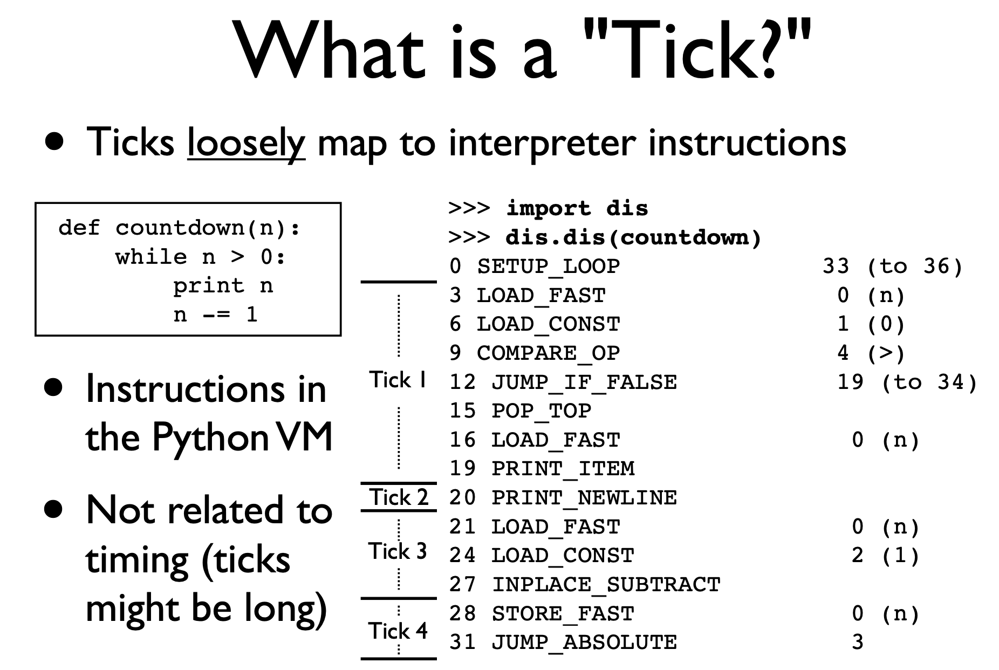

# GIL - Global interpreter lock

source: <http://www.dabeaz.com/python/UnderstandingGIL.pdf>

## Python Threads

- python threads are **real** system threads
  - posix threads (pthreads) for unix system
  - windows threads
- managed by the host os
- are threaded exec of the python interpreter process (written in C)

## GIL

- Parallel exec is forbid
- the GIL ensure on thread runs in the interpreter at once
- simplifies low-level details (memory mgt, callout to c etc...)

## Execution model

- cooperative multitasking
- when a threads is running it "holds" the GIL
- GIL released on I/O (read, write, send, recv...)

## CPU Bound Tasks

Special handle for cpu-bound threads that never perform I/O

- a "check" occurs every 100 "ticks"
- change it using sys.setcheckinterval()

## Ticks

## Check

the periodic check:
the currently running thread...

- resets the tick counter
- runs signal handlers if the main thread
- release the GIL
- reacquire the GIL

....
